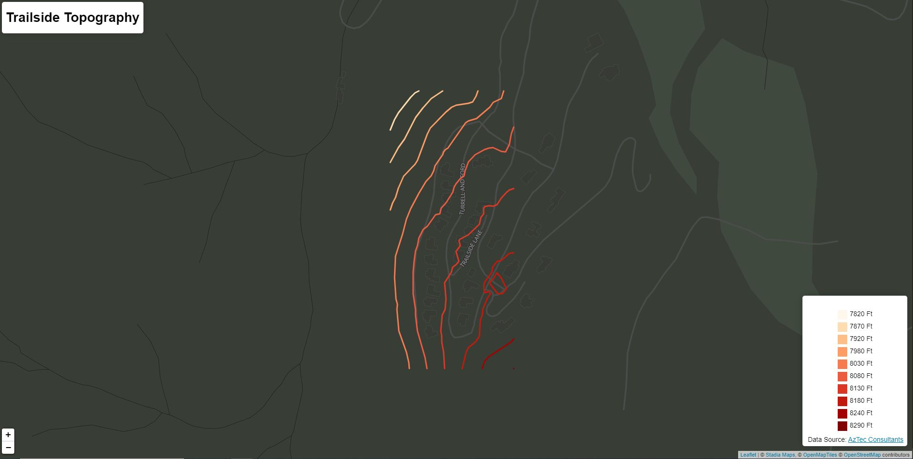

# CO_Oil_GAS
Colorado Oil and Gas Locations

## Data Conversion
Convert Shapefile to GeoJSON, filter fields, simplify coordinates and reproject to EPSG 4326 using mapshaper

```CLI
mapshaper Wells.shp -filter-fields Facil_Id,Well_Name,Operator,Facil_Stat -simplify dp 15% -proj wgs84 -o precision=.00001 format=geojson wells.json
```

## Create GeoJSON from csv joined to well.json
### File Name: process-csv.js
Creates a join between the csv and json file using the fility id.  Once joined the lat/lon from the well.json field is used to create a new json file representing spills at well sites.

## Create Hex Grid
### File Name: create-hex.js
Uses the wells.json and spill.json files to create a hex grid with counts of spills and wells per hexagon and writes the result out to a GeoJSON file.

## Oil Well Analysis
### File Name: oil_well_hexgrid.html
Displays a leaflet map with the hexgrid created above, and colors the hex grid based on the normalized spills.  ie Spills/Well


## Trailside Topography
### File Name: elevation_iso.html
Displays a leaflet map with topographic lines from a GeoJSON point grid with elevation values in the properties.  Utilizes the turf.isolines method to generate the data from a point grid.  Does not work if the point data is not in a grid format.  Tried random points from another site and the geometry exported empty.  


